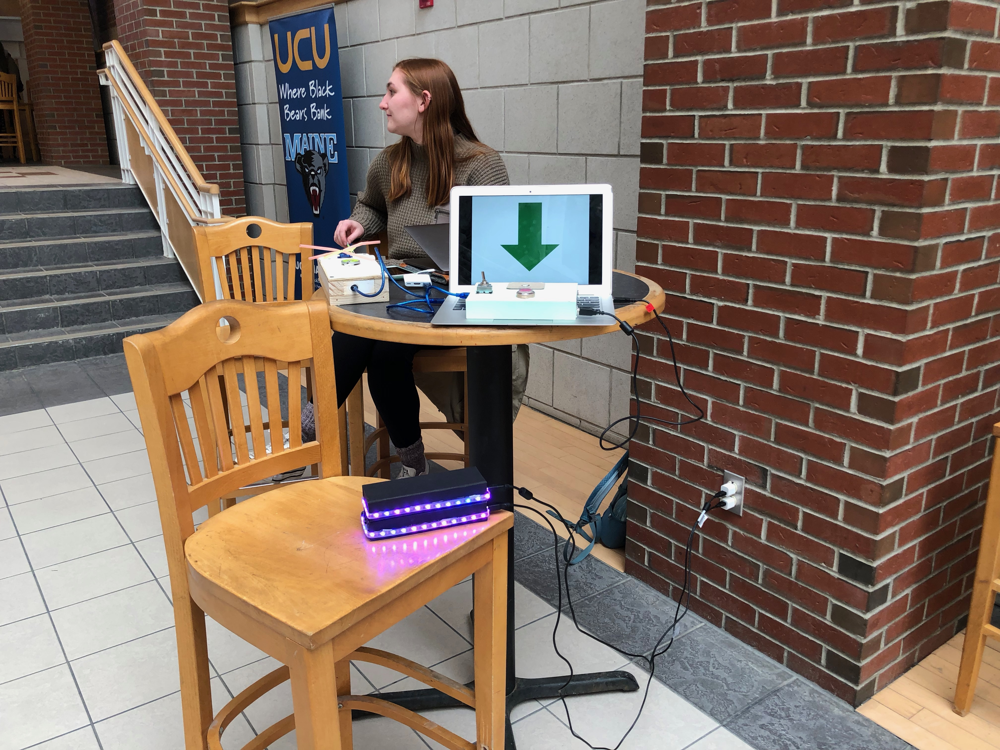
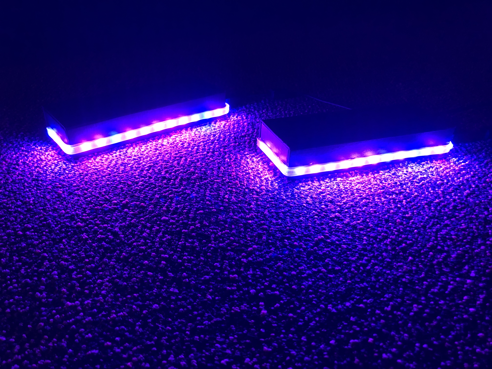

# Project #1
For this project, we were tasked with creating a device that would capture a stranger's interest using the concepts of interaction design discussed in class and in the readings. One aspect of this task was to prolong the interaction by rewarding the user with feedback (In other words, by giving them incentive to keep using the device). The design had to be made of durable materials so as to withstand minor abuse, and all wiring had to be hidden.

As much as I would like to say I met all of the expectations, I don't think I did. I tried my best with my limited knowledge of Arduinos to create what I had envisioned, but ultimately my lack of experience stood in the way. Despite this, I would not call the project a failure. If the goal was to learn about interaction design, then this "failure" was far more successful than it would have been if all expectations were easily met.

## The Project
### Description
My idea for this project was to create a set of interactive boxes that a user would discover the connections between as they used the system. Essentially, the idea was to have actions done to one box (such as rotating) directly influence the behavior of another (such as outputting sound, changing light colors, or changing how buttons behaved). Additional behaviors could arise from the combination of multiple boxes – i.e. the distance between two boxes influencing the intensity of light or sound on another box.

Conceptually, this idea was (and still is) relatively simple: once each box is given a unique set of functions, use XBees and/or NFC to establish communication between the boxes, then change/influence the functionality as desired. The various functions are described by the sketches I made for class: COMING SOON

### Code
I need to finish commenting the code, but once I do it will be posted on a second GitHub repository for NMD342 projects that has yet to be made. I will update this post once I have done this.

### Media

### Observations
When I set up the devices in the Union, and then in the library later on, very few people interacted with the project. Of those that did, the interaction lasted for only a short period of time and often ended with a simple statement of, "That's cool." While I can't expect everyone to form detailed opinions, I think the surface-level response to the project is an indication of a lack of understanding, and this is ultimately the fault of the project, not the user.

The link between the boxes was obvious to users, even if it did not work as well as I intended. Sometime about the combination of black and white boxes seems to make people assume they are meant to go together.

Most people interacted primarily with the NFC-enabled boxes that had lights that turned on/off based on proximity. This was expect.

### Reflection
Ultimately, I am disappointed with how the project turned out, however I realize that there is great benefit to this "failure" – so much so that it was perhaps more successful than the alternative. I've learned ways to improve almost every aspect of my process.

I used the waterfall model to design the devices. From the outside, I understand that the imperfection of the final product could lead someone to think the fault was in the design methodology, but as the only person who experienced the creation of my project specifically, I can affirm that this is not the whole story. My lack of past experience in physical computing was the primary factor. For example, due to my lack of certification at the IMRC, and therefore lack of access to a laser cutter, I had to acquire four identical boxes of reasonable build quality from Walmart. This wasn't too much of a hassle, but it severely limited the control I had over how the project would look. Of course, I could have spent more time searching for just the right boxes, but I didn't think that would be the best use of my time. In consequence, I disliked my project from the beginning, but had no clear way of fixing the problem. Instead of having precisely cut holes made specifically for the lights and sensors I was using, I had to use an X-Acto knife to cut holes in cardboard. Similarly, I had no control over the size or shape of the box, as I had a very limited set of choices and thus had to design the internals of the devices to the specifications of the box rather than the other way around. These constraints added unnecessary challenge to the project overall, and that challenge cannot be attributed to my usage of the the waterfall model.

I also couldn't get communication using XBees working at a satisfying degree of reliability. This led to wasted time, poor last-minute decisions, and ultimately a poor experience for users. Again, the fault wasn't so much in my usage of the waterfall model, but rather in my lack of ability/experience. Having gone through this project, though, I have identified where I lack experience and can address those concerns for next time.

I do not claim that the waterfall model played no role in some of my poor design decisions, such as placing a photoresistor at the side of the "top" device where few people discovered it. Once I had a design I did not question how it would be used–quite honestly, it just seemed obvious to me–but I realize that this is an absolutely necessary part of the design process.
